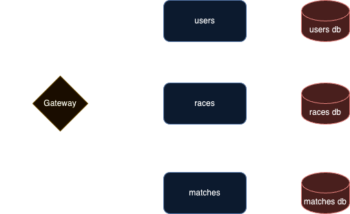

# hkjc-graphql-demo-supergraph-local

Mobile Applications and the BFF Architecture using GraphQL​

## Diagram




## Schema

### Users

```graphql
extend schema @link(url: "https://specs.apollo.dev/federation/v2.0", import: ["@key", "@shareable"])

type Query {
    users(first: Int = 10, after: ID): [User!]!
}

type Mutation {
  login(email: String!, password: String!): String
  register(command: RegisterInput!): User!
}

input RegisterInput {
  name: String!
  email: String!
  password: String!
  roles: [String!]!
}

type User @key(fields: "id") {
    id: ID!
    name: String!
    email: String!
    roles: [String!]!
}
```

### Races

```graphql
extend schema @link(url: "https://specs.apollo.dev/federation/v2.0", import: ["@key", "@shareable"])

type Query {
    races(first: Int = 10, after: ID): [Race!]!
    horses(first: Int = 10, after: ID): [Horse!]!
}

type Mutation {
  addRace(command: AddRaceInput!): Race!
  addHorse(command: AddHorseInput!): Horse!
  enrollHorse(command: EnrollHorseInput!): Horse!
}

input AddRaceInput {
  no: Int
  startTime: String!
  venue: String
}

input AddHorseInput {
  name: String!
  rank: Int
}

input EnrollHorseInput {
  race: ID!
  horse: ID!
}

type Race @key(fields: "id") {
    id: ID!
    no: Int
    startTime: String!
    venue: String!
    horses: [Horse]!
}

type Horse @key(fields: "id") {
    id: ID!
    name: String!
    rank: Int
    race: Race
}
```

### Matches

```graphql
extend schema @link(url: "https://specs.apollo.dev/federation/v2.0", import: ["@key", "@shareable"])

type Query {
    matches(first: Int = 10, after: ID): [FootballMatch]!
    teams(first: Int = 10, after: ID): [Team]!
    players(first: Int = 10, after: ID): [Player]!
}

type Mutation {
    addTeam(command: AddTeamInput!): Team
    addPlayer(command: AddPlayerInput!): Player
    joinTeam(command: JoinTeamInput!): Player
    addMatch(command: AddMatchInput!): FootballMatch
}

input AddTeamInput {
    name: String!
    country: String!
}

input AddPlayerInput {
    name: String!
    age: Int
    team: ID
}

input JoinTeamInput {
    player: ID!
    team: ID!
}

input AddMatchInput {
    no: Int
    startTime: String!
    venue: String!
    country: String!
    homeTeam: ID!
    visitorsTeam: ID!
}

type FootballMatch @key(fields: "id") {
    id: ID!
    no: Int
    startTime: String!
    venue: String!
    country: String!
    homeTeam: Team!
    visitorsTeam: Team!
}

type Team @key(fields: "id") {
    id: ID!
    name: String!
    country: String!
    players: [Player!]!
}

type Player @key(fields: "id") {
    id: ID!
    name: String!
    age: Int
    team: Team
}
```

## Auth

Login mutation:

```graphql
mutation Login($email: String!, $password: String!) {
  login(email: $email, password: $password)
}
```

with variables

```json
{
  "email": "johndoe@email.com",
  "password": "pAsSWoRd!"
}
```


Register mutation:

```graphql
mutation Register($command: RegisterInput!) {
  register(command: $command) {
    id
    name
    email
    roles
  }
}
```

with variables

```json
{
  "command": {
    "email": "your@email.com",
    "name": "name",
    "password": "password",
    "roles": ["role"]
  }
}
```

Auth token is expected in `x-access-token` header for all operations except `login`


## How To

From the root folder of the repository

To run the server:

```bash
make server-up
```

To rebuild the server containers:

```bash
make server-build
```

To tear-down the containers:

```bash
make server-down
```

## Testing with Jest & Cucumber

### setup

Add the required npm packages

```bash
npm install @cucumber/gherkin @types/jest jest
npm install --save-dev @tsconfig/node16 babel-jest jest-cucumber ts-jest ts-lint
```

and then add `jest` configuration to `package.json`

```json
"jest": {
  "verbose": true,
  "transform": {
    "^.+\\.tsx?$": "ts-jest"
  },
  "testMatch": [
    "**/*.steps.ts"
  ],
  "moduleDirectories": [
    "node_modules"
  ],
  "moduleFileExtensions": [
    "js",
    "ts",
    "tsx"
  ]
}
```

Finally add jest, lint and test scripts to `package.json`

```json
"scripts": {
  "build": "tsc && npm run copy-data",
  "jest": "jest --verbose",
  "lint": "tslint --project ./",
  "test": "npm run build & npm run lint & jest --color",
  ...
},
```

### scenarios

Add a `sample.feature` feature in the `specs/features` folder

```gherkin
Feature: Sample feature
  The feature description

  Rule: some sample rule

    Scenario: Feature scenario #1
      Given A scenario
      When A condition is verified
      Then The result is expected
```

In `specs/step-definitions` create the `sample.steps.ts` file to define yourt actual tests implementing the feature file

```ts
import { loadFeature, defineFeature } from "jest-cucumber";
import { expect } from "@jest/globals";

import { myFunction } from "../../src/myFunction";

const feature = loadFeature("./specs/features/query-races.feature");

defineFeature(feature, (test) => {
  let contextValue: { principal: any; dataSources: any };
  let actual: any[];
  let parent: any;
  let args: { first: Number; after: String };

  test("Feature scenario #1",
    ({ given, when, then }) => {
      given("A scenario", () => {
        args = ...
      });

      when("A condition is verified", () => {
        actual = myFunction(args);
      });

      then("The result is expected", () => {
        expect(actual).toBe(1);
      });
    }
  );
```

Run your tests 

```bash
npm test

> 
Test Suites: 1 passed, 1 total
Tests:       1 passed, 1 total
Snapshots:   0 total
Time:        0.701 s
Ran all test suites.
```

## SonarQube Scan

### setup

For each project in the monorepo, add the sonarqube dev dep

```bash
npm install sonar-scanner --save-dev
```

and add the `sonar-project.properties` file as follow

```env
sonar.host.url=http://sonarqube:9000
sonar.login=sqa_57636cdd63bd6c713dd7b040d12363b7badbe24d
sonar.projectKey=hkjc-graphql-demo-supergraph-local_users
sonar.projectName=hkjc-graphql-demo-supergraph-local_users
sonar.projectVersion=1.0
sonar.sourceEncoding=UTF-8
sonar.sources=src
sonar.exclusions=node_modules/**, dist/**
sonar.tests=src
sonar.test.inclusions=**/*.spec.ts
sonar.typescript.lcov.reportPaths=coverage/lcov.info
```

the url is set to work in jenkins, you can override locally or rely on the vs code extension `sonarlint (SonarSource.sonarlint-vscode)`.

Add a npm script in `package.json` to run the scan

```json
  "scripts": {
    "sonar": "sonar-scanner",
    ...
  }
```

### run

To run with the default properties in `sonar-project.properties`

```bash
npm run sonar 
```

you can override with

```bash
npm run sonar -- -Dsonar.host.url=http://localhost:9000
```
